# System Architecture Analysis

## Overview

- **Project**: /home/tom/github/pyfunc/taskfile
- **Analysis Mode**: static
- **Total Functions**: 247
- **Total Classes**: 35
- **Modules**: 38
- **Entry Points**: 139

## Architecture by Module

### src.taskfile.runner
- **Functions**: 27
- **Classes**: 2
- **File**: `runner.py`

### src.taskfile.quadlet
- **Functions**: 21
- **Classes**: 1
- **File**: `quadlet.py`

### src.taskfile.cli.setup
- **Functions**: 15
- **Classes**: 1
- **File**: `setup.py`

### src.taskfile.cli.deploy
- **Functions**: 15
- **Classes**: 1
- **File**: `deploy.py`

### src.taskfile.fleet
- **Functions**: 14
- **Classes**: 5
- **File**: `fleet.py`

### src.taskfile.models
- **Functions**: 14
- **Classes**: 8
- **File**: `models.py`

### src.taskfile.cli.release
- **Functions**: 14
- **File**: `release.py`

### src.taskfile.provisioner
- **Functions**: 12
- **Classes**: 2
- **File**: `provisioner.py`

### src.taskfile.cli.main
- **Functions**: 11
- **File**: `main.py`

### src.taskfile.compose
- **Functions**: 9
- **Classes**: 1
- **File**: `compose.py`

### src.taskfile.cirunner
- **Functions**: 9
- **Classes**: 3
- **File**: `cirunner.py`

### src.taskfile.cigen.base
- **Functions**: 9
- **Classes**: 1
- **File**: `base.py`

### src.taskfile.parser
- **Functions**: 8
- **Classes**: 2
- **File**: `parser.py`

### src.taskfile.cli.fleet
- **Functions**: 8
- **File**: `fleet.py`

### src.taskfile.cigen.gitlab
- **Functions**: 8
- **Classes**: 1
- **File**: `gitlab.py`

### src.taskfile.cli.auth
- **Functions**: 7
- **File**: `auth.py`

### src.taskfile.cigen.github
- **Functions**: 7
- **Classes**: 1
- **File**: `github.py`

### src.taskfile.health
- **Functions**: 6
- **Classes**: 2
- **File**: `health.py`

### src.taskfile.cli.quadlet
- **Functions**: 6
- **File**: `quadlet.py`

### src.taskfile.cli.ci
- **Functions**: 6
- **File**: `ci.py`

## Key Entry Points

Main execution flows into the system:

### src.taskfile.cli.fleet.fleet_repair_cmd
> Diagnose and repair a remote device.

Runs 8-point diagnostics: ping, SSH, disk, RAM, temperature,
podman, containers, NTP. Suggests fixes for each is
- **Calls**: fleet.command, click.argument, click.option, src.taskfile.cli.fleet._load_config_or_exit, console.print, console.print, _safe_ssh, _safe_ssh

### src.taskfile.cli.fleet.fleet_status_cmd
> Show status of all remote environments (SSH-based health check).


Examples:
    taskfile fleet status
    taskfile fleet status --group kiosks
- **Calls**: fleet.command, click.option, src.taskfile.cli.fleet._load_config_or_exit, src.taskfile.cli.fleet._get_remote_envs, console.print, results.sort, Table, table.add_column

### src.taskfile.cli.ci.ci_generate
> Generate CI/CD config files from Taskfile.yml pipeline section.


Examples:
    taskfile ci generate --target github
    taskfile ci generate --targe
- **Calls**: ci.command, click.option, click.option, click.option, src.taskfile.parser.load_taskfile, console.print, None.join, console.print

### src.taskfile.fleet.FleetConfig.from_dict
> Parse raw YAML dict into FleetConfig.
- **Calls**: data.get, cls, None.items, None.items, None.items, isinstance, isinstance, isinstance

### src.taskfile.cli.auth.auth_setup
> Interactive registry authentication setup.

Guides you through obtaining API tokens for each registry
and saves them to .env (automatically gitignored
- **Calls**: auth.command, click.option, console.print, Path, enumerate, src.taskfile.cli.auth._ensure_gitignore, console.print, console.print

### src.taskfile.cli.release.rollback
> Rollback to previous version.

Deploys the previous (or specified) version of the web application.


Examples:
    taskfile rollback              # R
- **Calls**: main.command, click.option, click.option, click.option, console.print, src.taskfile.cli.release._run_command, src.taskfile.parser.load_taskfile, src.taskfile.cli.release._get_previous_tag

### src.taskfile.cirunner.PipelineRunner.run
> Run pipeline stages in order.

Args:
    stage_filter: Only run these stages (None = all non-manual)
    skip_stages: Skip these stages
    stop_at: S
- **Calls**: self._resolve_stages, self._print_pipeline_header, time.time, enumerate, self._print_summary, console.print, console.print, console.print

### src.taskfile.fleet.check_device_status
> Check the status of a single device via SSH.
- **Calls**: DeviceStatus, src.taskfile.fleet._ping_device, src.taskfile.fleet._ssh_cmd, None.split, None.isdigit, None.isdigit, int, None.isdigit

### src.taskfile.models.PipelineConfig.from_dict
- **Calls**: cls, data.get, isinstance, str, data.get, data.get, data.get, data.get

### src.taskfile.models.TaskfileConfig._parse_tasks
> Parse all task definitions.
- **Calls**: tasks_section.items, isinstance, task_data.get, Task, isinstance, task_data.get, Task, task_data.get

### src.taskfile.models.TaskfileConfig.from_dict
> Parse raw YAML dict into TaskfileConfig.
- **Calls**: cls, cls._parse_compose, cls._parse_environments, cls._parse_environment_groups, cls._parse_platforms, cls._parse_tasks, cls._parse_pipeline, data.get

### src.taskfile.cli.main.info
> Show detailed info about a specific task.
- **Calls**: main.command, click.argument, src.taskfile.parser.load_taskfile, console.print, console.print, console.print, sys.exit, console.print

### src.taskfile.cli.quadlet.quadlet_generate
> Generate Quadlet .container files from docker-compose.yml.


Examples:
    taskfile quadlet generate
    taskfile quadlet generate --env-file .env.pr
- **Calls**: quadlet.command, click.option, click.option, click.option, click.option, click.option, click.option, opts.get

### src.taskfile.cigen.makefile.MakefileTarget.generate
- **Calls**: sorted, None.join, self.config.tasks.items, task_name.replace, lines.append, lines.append, lines.append, lines.append

### src.taskfile.cli.health.health_cmd
> Check health of deployed services.

Verifies web app, landing page, and infrastructure are responding.


Examples:
    taskfile --env prod health
   
- **Calls**: main.command, click.option, click.option, click.option, click.option, click.option, src.taskfile.parser.load_taskfile, console.print

### src.taskfile.cli.ci.ci_run
> Run CI/CD pipeline stages locally.

Runs the same pipeline that would run on GitHub/GitLab/etc,
but directly on your machine. No runner needed.


Exa
- **Calls**: ci.command, click.option, click.option, click.option, src.taskfile.parser.load_taskfile, PipelineRunner, runner.run, sys.exit

### src.taskfile.fleet.print_fleet_status
> Print fleet status as a rich table.
- **Calls**: Table, table.add_column, table.add_column, table.add_column, table.add_column, table.add_column, table.add_column, table.add_column

### src.taskfile.models.TaskfileConfig._parse_environments
> Parse all environment definitions, ensuring 'local' always exists.
- **Calls**: env_section.items, isinstance, Environment, Environment, env_data.get, env_data.get, env_data.get, env_data.get

### src.taskfile.cli.setup.setup
> One-command VPS setup: SSH key → provision → deploy.

IP can be provided as argument or interactively.


Examples:
    taskfile setup 123.45.67.89
  
- **Calls**: main.command, click.argument, click.option, click.option, click.option, click.option, click.option, click.option

### src.taskfile.cli.release.release
> Full release — build all, deploy all, update landing.

Orchestrates the complete release pipeline:
1. Create git tag (if specified)
2. Build desktop a
- **Calls**: main.command, click.option, click.option, click.option, click.option, click.option, click.option, src.taskfile.cli.release._resolve_release_config

### src.taskfile.runner.TaskfileRunner._run_dependencies_parallel
> Run task dependencies concurrently. Returns False if any failed.
- **Calls**: console.print, ThreadPoolExecutor, as_completed, console.print, executor.submit, console.print, len, len

### src.taskfile.cli.auth.auth_verify
> Test all configured registry credentials.


Examples:
    taskfile auth verify
- **Calls**: auth.command, console.print, Path, src.taskfile.cli.auth._read_env_file, sum, len, console.print, console.print

### src.taskfile.cli.quadlet.quadlet_upload
> Upload generated Quadlet files to remote server via SSH.

Uses environment settings from Taskfile.yml for SSH connection
and remote quadlet directory.
- **Calls**: quadlet.command, click.option, opts.get, opts.get, src.taskfile.parser.load_taskfile, src.taskfile.cli.quadlet._get_upload_env, src.taskfile.cli.quadlet._get_upload_files, src.taskfile.cli.quadlet._run_upload_commands

### src.taskfile.cli.fleet.fleet_list_cmd
> List all remote environments and environment groups.


Examples:
    taskfile fleet list
- **Calls**: fleet.command, src.taskfile.cli.fleet._load_config_or_exit, ctx.obj.get, console.print, sorted, console.print, console.print, sorted

### src.taskfile.cli.deploy.deploy_cmd
> Full deploy pipeline: build → push → generate Quadlet → upload → restart.

Reads environment config from Taskfile.yml and performs the correct
deploy 
- **Calls**: main.command, click.option, ctx.obj.get, ctx.obj.get, src.taskfile.cli.deploy._resolve_deploy_config, src.taskfile.cli.deploy._print_deploy_header, src.taskfile.cli.deploy._select_deploy_strategy, src.taskfile.cli.deploy._execute_deploy_strategy

### src.taskfile.cli.main.main
> taskfile — Universal task runner with multi-environment deploy.


Run tasks:     taskfile run build deploy
List tasks:    taskfile list
Init project:
- **Calls**: click.group, click.version_option, click.option, click.option, click.option, click.option, click.option, click.option

### src.taskfile.cli.main.init
> Create a new Taskfile.yml in the current directory.


Templates:
    minimal        — basic build/deploy tasks
    web            — web app with Dock
- **Calls**: main.command, click.option, click.option, Path, src.taskfile.scaffold.generate_taskfile, outpath.write_text, console.print, console.print

### src.taskfile.cli.main.validate
> Validate the Taskfile without running anything.
- **Calls**: main.command, src.taskfile.parser.load_taskfile, src.taskfile.parser.validate_taskfile, console.print, console.print, console.print, console.print, sys.exit

### src.taskfile.cli.ci.ci_preview
> Preview generated CI/CD config without writing files.


Examples:
    taskfile ci preview --target github
    taskfile ci preview --target gitlab
- **Calls**: ci.command, click.option, src.taskfile.parser.load_taskfile, src.taskfile.cigen.preview_ci, console.print, console.print, opts.get, console.print

### src.taskfile.cli.main.run
> Run one or more tasks.


Examples:
    taskfile run build
    taskfile run build deploy --env prod
    taskfile run release --var TAG=v1.2.3
    task
- **Calls**: main.command, click.argument, opts.get, sys.exit, src.taskfile.cli.main._run_env_group, TaskfileRunner, runner.run, console.print

## Process Flows

Key execution flows identified:

### Flow 1: fleet_repair_cmd
```
fleet_repair_cmd [src.taskfile.cli.fleet]
  └─> _load_config_or_exit
      └─ →> load_taskfile
          └─> find_taskfile
```

### Flow 2: fleet_status_cmd
```
fleet_status_cmd [src.taskfile.cli.fleet]
  └─> _load_config_or_exit
      └─ →> load_taskfile
          └─> find_taskfile
  └─> _get_remote_envs
```

### Flow 3: ci_generate
```
ci_generate [src.taskfile.cli.ci]
  └─ →> load_taskfile
      └─> find_taskfile
```

### Flow 4: from_dict
```
from_dict [src.taskfile.fleet.FleetConfig]
```

### Flow 5: auth_setup
```
auth_setup [src.taskfile.cli.auth]
```

### Flow 6: rollback
```
rollback [src.taskfile.cli.release]
```

### Flow 7: run
```
run [src.taskfile.cirunner.PipelineRunner]
```

### Flow 8: check_device_status
```
check_device_status [src.taskfile.fleet]
  └─> _ping_device
  └─> _ssh_cmd
```

### Flow 9: _parse_tasks
```
_parse_tasks [src.taskfile.models.TaskfileConfig]
```

### Flow 10: info
```
info [src.taskfile.cli.main]
  └─ →> load_taskfile
      └─> find_taskfile
```

## Key Classes

### src.taskfile.runner.TaskfileRunner
> Executes tasks from a Taskfile configuration.
- **Methods**: 26
- **Key Methods**: src.taskfile.runner.TaskfileRunner.__init__, src.taskfile.runner.TaskfileRunner._init_config, src.taskfile.runner.TaskfileRunner._init_environment, src.taskfile.runner.TaskfileRunner._init_platform, src.taskfile.runner.TaskfileRunner._init_variables, src.taskfile.runner.TaskfileRunner.expand_variables, src.taskfile.runner.TaskfileRunner.run_command, src.taskfile.runner.TaskfileRunner._is_remote_command, src.taskfile.runner.TaskfileRunner._strip_remote_prefix, src.taskfile.runner.TaskfileRunner._wrap_ssh

### src.taskfile.provisioner.VPSProvisioner
> Idempotent VPS provisioner using SSH.
- **Methods**: 11
- **Key Methods**: src.taskfile.provisioner.VPSProvisioner.__init__, src.taskfile.provisioner.VPSProvisioner._ssh, src.taskfile.provisioner.VPSProvisioner._check_command, src.taskfile.provisioner.VPSProvisioner.provision, src.taskfile.provisioner.VPSProvisioner._system_update, src.taskfile.provisioner.VPSProvisioner._install_podman, src.taskfile.provisioner.VPSProvisioner._setup_firewall, src.taskfile.provisioner.VPSProvisioner._create_deploy_user, src.taskfile.provisioner.VPSProvisioner._setup_traefik, src.taskfile.provisioner.VPSProvisioner._setup_tls

### src.taskfile.compose.ComposeFile
> Parsed docker-compose.yml with environment resolution.
- **Methods**: 9
- **Key Methods**: src.taskfile.compose.ComposeFile.__init__, src.taskfile.compose.ComposeFile.services, src.taskfile.compose.ComposeFile.networks, src.taskfile.compose.ComposeFile.volumes, src.taskfile.compose.ComposeFile.get_service, src.taskfile.compose.ComposeFile._labels_list_to_dict, src.taskfile.compose.ComposeFile._filter_traefik_labels, src.taskfile.compose.ComposeFile.get_traefik_labels, src.taskfile.compose.ComposeFile.service_names

### src.taskfile.cigen.gitlab.GitLabCITarget
- **Methods**: 8
- **Key Methods**: src.taskfile.cigen.gitlab.GitLabCITarget._tag_var, src.taskfile.cigen.gitlab.GitLabCITarget._build_base_doc, src.taskfile.cigen.gitlab.GitLabCITarget._build_job, src.taskfile.cigen.gitlab.GitLabCITarget._apply_dind, src.taskfile.cigen.gitlab.GitLabCITarget._apply_when_rules, src.taskfile.cigen.gitlab.GitLabCITarget._apply_ssh_setup, src.taskfile.cigen.gitlab.GitLabCITarget._apply_artifacts, src.taskfile.cigen.gitlab.GitLabCITarget.generate
- **Inherits**: CITarget

### src.taskfile.cirunner.PipelineRunner
> Runs CI/CD pipeline stages locally using TaskfileRunner.

The pipeline is just an ordered list of st
- **Methods**: 7
- **Key Methods**: src.taskfile.cirunner.PipelineRunner.__init__, src.taskfile.cirunner.PipelineRunner.run, src.taskfile.cirunner.PipelineRunner._should_skip_stage, src.taskfile.cirunner.PipelineRunner._resolve_stages, src.taskfile.cirunner.PipelineRunner._print_pipeline_header, src.taskfile.cirunner.PipelineRunner._print_summary, src.taskfile.cirunner.PipelineRunner.list_stages

### src.taskfile.models.TaskfileConfig
> Parsed Taskfile configuration.
- **Methods**: 7
- **Key Methods**: src.taskfile.models.TaskfileConfig.from_dict, src.taskfile.models.TaskfileConfig._parse_compose, src.taskfile.models.TaskfileConfig._parse_environments, src.taskfile.models.TaskfileConfig._parse_environment_groups, src.taskfile.models.TaskfileConfig._parse_platforms, src.taskfile.models.TaskfileConfig._parse_tasks, src.taskfile.models.TaskfileConfig._parse_pipeline

### src.taskfile.cigen.github.GitHubActionsTarget
- **Methods**: 7
- **Key Methods**: src.taskfile.cigen.github.GitHubActionsTarget._tag_var, src.taskfile.cigen.github.GitHubActionsTarget._build_steps, src.taskfile.cigen.github.GitHubActionsTarget._apply_conditions, src.taskfile.cigen.github.GitHubActionsTarget._has_tag_stages, src.taskfile.cigen.github.GitHubActionsTarget._build_on_triggers, src.taskfile.cigen.github.GitHubActionsTarget.generate, src.taskfile.cigen.github.GitHubActionsTarget._apply_secrets_env
- **Inherits**: CITarget

### src.taskfile.cigen.base.CITarget
> Base class for CI/CD target generators.
- **Methods**: 6
- **Key Methods**: src.taskfile.cigen.base.CITarget.__init__, src.taskfile.cigen.base.CITarget.generate, src.taskfile.cigen.base.CITarget.write, src.taskfile.cigen.base.CITarget._tag_var, src.taskfile.cigen.base.CITarget._stage_env_flag, src.taskfile.cigen.base.CITarget._stage_tasks_cmd

### src.taskfile.cigen.drone.DroneCITarget
- **Methods**: 5
- **Key Methods**: src.taskfile.cigen.drone.DroneCITarget._tag_var, src.taskfile.cigen.drone.DroneCITarget._build_base_doc, src.taskfile.cigen.drone.DroneCITarget._build_step, src.taskfile.cigen.drone.DroneCITarget._add_global_volumes, src.taskfile.cigen.drone.DroneCITarget.generate
- **Inherits**: CITarget

### src.taskfile.models.Environment
> Deployment environment configuration.
- **Methods**: 4
- **Key Methods**: src.taskfile.models.Environment.ssh_target, src.taskfile.models.Environment.ssh_opts, src.taskfile.models.Environment.is_remote, src.taskfile.models.Environment.resolve_variables

### src.taskfile.health.HealthReport
> Aggregated health check report.
- **Methods**: 2
- **Key Methods**: src.taskfile.health.HealthReport.healthy_count, src.taskfile.health.HealthReport.unhealthy_count

### src.taskfile.models.Task
> Single task definition.
- **Methods**: 2
- **Key Methods**: src.taskfile.models.Task.should_run_on, src.taskfile.models.Task.should_run_on_platform

### src.taskfile.models.PipelineConfig
> CI/CD pipeline configuration.
- **Methods**: 2
- **Key Methods**: src.taskfile.models.PipelineConfig.from_dict, src.taskfile.models.PipelineConfig.infer_from_tasks

### src.taskfile.cigen.jenkins.JenkinsTarget
- **Methods**: 2
- **Key Methods**: src.taskfile.cigen.jenkins.JenkinsTarget._tag_var, src.taskfile.cigen.jenkins.JenkinsTarget.generate
- **Inherits**: CITarget

### src.taskfile.cigen.gitea.GiteaActionsTarget
- **Methods**: 2
- **Key Methods**: src.taskfile.cigen.gitea.GiteaActionsTarget._tag_var, src.taskfile.cigen.gitea.GiteaActionsTarget.generate
- **Inherits**: CITarget

### src.taskfile.runner.TaskRunError
> Raised when a task command fails.
- **Methods**: 1
- **Key Methods**: src.taskfile.runner.TaskRunError.__init__
- **Inherits**: Exception

### src.taskfile.cirunner.PipelineError
> Raised when a pipeline stage fails.
- **Methods**: 1
- **Key Methods**: src.taskfile.cirunner.PipelineError.__init__
- **Inherits**: Exception

### src.taskfile.cirunner.StageResult
> Result of running a single pipeline stage.
- **Methods**: 1
- **Key Methods**: src.taskfile.cirunner.StageResult.__init__

### src.taskfile.fleet.FleetConfig
> Parsed fleet.yml configuration.
- **Methods**: 1
- **Key Methods**: src.taskfile.fleet.FleetConfig.from_dict

### src.taskfile.models.Platform
> Target platform configuration (e.g. desktop, web, mobile).
- **Methods**: 1
- **Key Methods**: src.taskfile.models.Platform.resolve_variables

## Data Transformation Functions

Key functions that process and transform data:

### src.taskfile.parser._validate_tasks_exist
> Check that at least one task is defined.

### src.taskfile.parser._validate_task_commands
> Check that task has at least one command.

### src.taskfile.parser._validate_task_dependencies
> Check that all task dependencies exist.
- **Output to**: warnings.append

### src.taskfile.parser._validate_task_env_filter
> Check that all environment references in filters exist.
- **Output to**: warnings.append

### src.taskfile.parser._validate_task_platform_filter
> Check that all platform references in filters exist.
- **Output to**: warnings.append

### src.taskfile.parser.validate_taskfile
> Validate a TaskfileConfig and return list of warnings.
- **Output to**: warnings.extend, config.tasks.items, src.taskfile.parser._validate_tasks_exist, warnings.extend, warnings.extend

### src.taskfile.models.TaskfileConfig._parse_compose
> Parse the compose section of Taskfile.
- **Output to**: ComposeConfig, isinstance, ComposeConfig, compose_data.get, compose_data.get

### src.taskfile.models.TaskfileConfig._parse_environments
> Parse all environment definitions, ensuring 'local' always exists.
- **Output to**: env_section.items, isinstance, Environment, Environment, env_data.get

### src.taskfile.models.TaskfileConfig._parse_environment_groups
> Parse environment_groups section.
- **Output to**: groups_section.items, isinstance, EnvironmentGroup, grp_data.get, grp_data.get

### src.taskfile.models.TaskfileConfig._parse_platforms
> Parse all platform definitions.
- **Output to**: plat_section.items, isinstance, Platform, plat_data.get, plat_data.get

### src.taskfile.models.TaskfileConfig._parse_tasks
> Parse all task definitions.
- **Output to**: tasks_section.items, isinstance, task_data.get, Task, isinstance

### src.taskfile.models.TaskfileConfig._parse_pipeline
> Parse pipeline section and infer stages from tasks if needed.
- **Output to**: isinstance, pipeline.infer_from_tasks, PipelineConfig.from_dict, PipelineConfig

### src.taskfile.cli.setup._validate_ip
> Validate IP address format.
- **Output to**: bool, re.match

### src.taskfile.cli.setup._validate_ssh_key
> Check if SSH key file exists.
- **Output to**: os.path.expanduser, None.is_file, Path

### src.taskfile.cli.setup._parse_ports
> Parse comma-separated port string into list of ints.
- **Output to**: int, console.print, sys.exit, p.strip, ports.split

### src.taskfile.cli.main.parse_var
> Parse --var KEY=VALUE pairs into a dict.
- **Output to**: item.split, val.strip, click.BadParameter, key.strip

### src.taskfile.cli.main.validate
> Validate the Taskfile without running anything.
- **Output to**: main.command, src.taskfile.parser.load_taskfile, src.taskfile.parser.validate_taskfile, console.print, console.print

### src.taskfile.quadlet._parse_port
> Parse '8080:80' → ('8080', '80') or '80' → ('80', '80').
- **Output to**: None.split, len, str

### src.taskfile.quadlet._parse_memory_limit
> Extract memory limit from deploy.resources.limits.memory.

### src.taskfile.quadlet._parse_cpus_limit
> Extract CPU limit from deploy.resources.limits.cpus.
- **Output to**: str

## Behavioral Patterns

### recursion_resolve_dict
- **Type**: recursion
- **Confidence**: 0.90
- **Functions**: src.taskfile.compose.resolve_dict

## Public API Surface

Functions exposed as public API (no underscore prefix):

- `src.taskfile.cli.fleet.fleet_repair_cmd` - 71 calls
- `src.taskfile.cli.fleet.fleet_status_cmd` - 53 calls
- `src.taskfile.cli.ci.ci_generate` - 41 calls
- `src.taskfile.fleet.FleetConfig.from_dict` - 32 calls
- `src.taskfile.cli.auth.auth_setup` - 30 calls
- `src.taskfile.cli.release.rollback` - 30 calls
- `src.taskfile.cirunner.PipelineRunner.run` - 28 calls
- `src.taskfile.fleet.check_device_status` - 26 calls
- `src.taskfile.models.PipelineConfig.from_dict` - 25 calls
- `src.taskfile.health.check_http_endpoint` - 23 calls
- `src.taskfile.models.TaskfileConfig.from_dict` - 20 calls
- `src.taskfile.cli.main.info` - 20 calls
- `src.taskfile.cli.quadlet.quadlet_generate` - 19 calls
- `src.taskfile.cigen.makefile.MakefileTarget.generate` - 18 calls
- `src.taskfile.cli.health.health_cmd` - 17 calls
- `src.taskfile.cli.ci.ci_run` - 17 calls
- `src.taskfile.fleet.print_fleet_status` - 16 calls
- `src.taskfile.cli.setup.setup` - 16 calls
- `src.taskfile.cli.release.release` - 16 calls
- `src.taskfile.fleet.deploy_to_device` - 15 calls
- `src.taskfile.cli.auth.auth_verify` - 15 calls
- `src.taskfile.cli.quadlet.quadlet_upload` - 15 calls
- `src.taskfile.health.print_health_report` - 14 calls
- `src.taskfile.cli.fleet.fleet_list_cmd` - 14 calls
- `src.taskfile.health.run_health_checks` - 13 calls
- `src.taskfile.cli.deploy.deploy_cmd` - 13 calls
- `src.taskfile.cli.main.main` - 12 calls
- `src.taskfile.cli.main.init` - 12 calls
- `src.taskfile.cli.main.validate` - 12 calls
- `src.taskfile.parser.load_taskfile` - 11 calls
- `src.taskfile.parser.validate_taskfile` - 11 calls
- `src.taskfile.cli.ci.ci_preview` - 11 calls
- `src.taskfile.cli.main.run` - 11 calls
- `src.taskfile.compose.load_env_file` - 10 calls
- `src.taskfile.health.check_ssh_service` - 10 calls
- `src.taskfile.fleet.deploy_to_group` - 10 calls
- `src.taskfile.runner.TaskfileRunner.run_task` - 9 calls
- `src.taskfile.fleet.fleet_status` - 9 calls
- `src.taskfile.landing.generate_landing_page` - 8 calls
- `src.taskfile.compose.resolve_variables` - 8 calls

## System Interactions

How components interact:

```mermaid
graph TD
    fleet_repair_cmd --> command
    fleet_repair_cmd --> argument
    fleet_repair_cmd --> option
    fleet_repair_cmd --> _load_config_or_exit
    fleet_repair_cmd --> print
    fleet_status_cmd --> command
    fleet_status_cmd --> option
    fleet_status_cmd --> _load_config_or_exit
    fleet_status_cmd --> _get_remote_envs
    fleet_status_cmd --> print
    ci_generate --> command
    ci_generate --> option
    ci_generate --> load_taskfile
    from_dict --> get
    from_dict --> cls
    from_dict --> items
    auth_setup --> command
    auth_setup --> option
    auth_setup --> print
    auth_setup --> Path
    auth_setup --> enumerate
    rollback --> command
    rollback --> option
    rollback --> print
    run --> _resolve_stages
    run --> _print_pipeline_head
    run --> time
    run --> enumerate
    run --> _print_summary
    check_device_status --> DeviceStatus
```



## Reverse Engineering Guidelines

1. **Entry Points**: Start analysis from the entry points listed above
2. **Core Logic**: Focus on classes with many methods
3. **Data Flow**: Follow data transformation functions
4. **Process Flows**: Use the flow diagrams for execution paths
5. **API Surface**: Public API functions reveal the interface

## Context for LLM

Maintain the identified architectural patterns and public API surface when suggesting changes.