# System Architecture Analysis

## Overview

- **Project**: /home/tom/github/pyfunc/taskfile
- **Analysis Mode**: static
- **Total Functions**: 436
- **Total Classes**: 51
- **Modules**: 61
- **Entry Points**: 262

## Architecture by Module

### src.taskfile.runner
- **Functions**: 35
- **Classes**: 2
- **File**: `runner.py`

### src.taskfile.cli.diagnostics
- **Functions**: 21
- **Classes**: 1
- **File**: `diagnostics.py`

### src.taskfile.quadlet
- **Functions**: 21
- **Classes**: 1
- **File**: `quadlet.py`

### src.taskfile.models
- **Functions**: 15
- **Classes**: 9
- **File**: `models.py`

### src.taskfile.cli.setup
- **Functions**: 15
- **Classes**: 1
- **File**: `setup.py`

### src.taskfile.cli.deploy
- **Functions**: 15
- **Classes**: 1
- **File**: `deploy.py`

### src.taskfile.cli.main
- **Functions**: 15
- **File**: `main.py`

### src.taskfile.registry
- **Functions**: 14
- **Classes**: 2
- **File**: `registry.py`

### src.taskfile.fleet
- **Functions**: 14
- **Classes**: 5
- **File**: `fleet.py`

### src.taskfile.webui
- **Functions**: 14
- **Classes**: 2
- **File**: `webui.py`

### src.taskfile.cli.interactive
- **Functions**: 14
- **File**: `interactive.py`

### src.taskfile.cli.release
- **Functions**: 14
- **File**: `release.py`

### src.taskfile.provisioner
- **Functions**: 12
- **Classes**: 2
- **File**: `provisioner.py`

### src.taskfile.cli.fleet_diagnostics
- **Functions**: 12
- **Classes**: 2
- **File**: `fleet_diagnostics.py`

### src.taskfile.converters
- **Functions**: 11
- **Classes**: 5
- **File**: `converters.py`

### src.taskfile.parser
- **Functions**: 11
- **Classes**: 2
- **File**: `parser.py`

### src.taskfile.cache
- **Functions**: 11
- **Classes**: 1
- **File**: `cache.py`

### src.taskfile.cli.version
- **Functions**: 11
- **File**: `version.py`

### src.taskfile.importer
- **Functions**: 9
- **File**: `importer.py`

### src.taskfile.compose
- **Functions**: 9
- **Classes**: 1
- **File**: `compose.py`

## Key Entry Points

Main execution flows into the system:

### src.taskfile.cli.fleet.fleet_repair_cmd
> Diagnose and repair a remote device.

Runs 8-point diagnostics: ping, SSH, disk, RAM, temperature,
podman, containers, NTP. Suggests fixes for each is
- **Calls**: fleet.command, click.argument, click.option, src.taskfile.cli.fleet._load_config_or_exit, console.print, console.print, src.taskfile.cli.fleet_diagnostics._safe_ssh, src.taskfile.cli.fleet_diagnostics._safe_ssh

### src.taskfile.cli.fleet.fleet_status_cmd
> Show status of all remote environments (SSH-based health check).


Examples:
    taskfile fleet status
    taskfile fleet status --group kiosks
- **Calls**: fleet.command, click.option, src.taskfile.cli.fleet._load_config_or_exit, src.taskfile.cli.fleet._get_remote_envs, console.print, results.sort, Table, table.add_column

### src.taskfile.cli.ci.ci_generate
> Generate CI/CD config files from Taskfile.yml pipeline section.


Examples:
    taskfile ci generate --target github
    taskfile ci generate --targe
- **Calls**: ci.command, click.option, click.option, click.option, src.taskfile.parser.load_taskfile, console.print, None.join, console.print

### src.taskfile.cli.main.run
> Run one or more tasks.


Examples:
    taskfile run build
    taskfile run build deploy --env prod
    taskfile run release --var TAG=v1.2.3
    task
- **Calls**: main.command, click.argument, click.option, opts.get, sys.exit, t.strip, src.taskfile.cli.main._run_env_group, TaskfileRunner

### src.taskfile.fleet.FleetConfig.from_dict
> Parse raw YAML dict into FleetConfig.
- **Calls**: data.get, cls, None.items, None.items, None.items, isinstance, isinstance, isinstance

### src.taskfile.cli.version.bump
> Bump version number (patch, minor, or major).

Updates VERSION file and optionally creates git tag.


Examples:
    taskfile version bump        # Bu
- **Calls**: version.command, click.argument, click.option, click.option, version_file.exists, src.taskfile.cli.version._increment_version, console.print, version_file.write_text

### src.taskfile.cli.interactive.init
> ✨ Create a new Taskfile.yml with interactive setup.

Without --interactive: uses template argument or minimal
With --interactive: prompts for all conf
- **Calls**: main.command, click.option, click.option, click.option, Path, src.taskfile.scaffold.generate_taskfile, outpath.write_text, console.print

### src.taskfile.cli.auth.auth_setup
> Interactive registry authentication setup.

Guides you through obtaining API tokens for each registry
and saves them to .env (automatically gitignored
- **Calls**: auth.command, click.option, console.print, Path, enumerate, src.taskfile.cli.auth._ensure_gitignore, console.print, console.print

### src.taskfile.models.TaskfileConfig._parse_tasks
> Parse all task definitions.
- **Calls**: tasks_section.items, isinstance, task_data.get, task_data.get, isinstance, Task, isinstance, task_data.get

### src.taskfile.cli.release.rollback
> Rollback to previous version.

Deploys the previous (or specified) version of the web application.


Examples:
    taskfile rollback              # R
- **Calls**: main.command, click.option, click.option, click.option, console.print, src.taskfile.cli.release._run_command, src.taskfile.parser.load_taskfile, src.taskfile.cli.release._get_previous_tag

### src.taskfile.cli.main.info
> Show detailed info about a specific task.
- **Calls**: main.command, click.argument, src.taskfile.parser.load_taskfile, console.print, console.print, sys.exit, console.print, console.print

### src.taskfile.cirunner.PipelineRunner.run
> Run pipeline stages in order.

Args:
    stage_filter: Only run these stages (None = all non-manual)
    skip_stages: Skip these stages
    stop_at: S
- **Calls**: self._resolve_stages, self._print_pipeline_header, time.time, enumerate, self._print_summary, console.print, console.print, console.print

### src.taskfile.cli.import_export.import_cmd
> 📥 Import from Makefile, GitHub Actions, GitLab CI, npm scripts, etc.

Converts existing build configurations to Taskfile format.


Supported sources:
- **Calls**: main.command, click.argument, click.option, click.option, click.option, Path, Path, outpath.exists

### src.taskfile.cli.import_export.export_cmd
> 📤 Export Taskfile to other formats.

Convert Taskfile to Makefile, GitHub Actions, npm scripts, etc.


Supported targets:
    makefile        — GNU M
- **Calls**: main.command, click.argument, click.option, click.option, click.option, click.option, Path, defaults.get

### src.taskfile.fleet.check_device_status
> Check the status of a single device via SSH.
- **Calls**: DeviceStatus, src.taskfile.fleet._ping_device, src.taskfile.fleet._ssh_cmd, None.split, None.isdigit, None.isdigit, int, None.isdigit

### src.taskfile.cli.registry_cmds.pkg_install
> Install a package from the registry.

Package names can be:
    - GitHub repo: user/repo or github:user/repo
    - Direct URL: https://example.com/tas
- **Calls**: pkg.command, click.argument, click.option, click.option, click.option, click.option, RegistryClient, console.print

### src.taskfile.runner.TaskfileRunner.run
> Run multiple tasks in order. Returns True if all succeed.
- **Calls**: src.taskfile.parser.validate_taskfile, time.time, console.print, any, time.time, src.taskfile.notifications.notify_task_complete, ssh_close_all, len

### src.taskfile.models.PipelineConfig.from_dict
- **Calls**: cls, data.get, isinstance, str, data.get, data.get, data.get, data.get

### src.taskfile.cli.interactive.doctor
> 🔧 Diagnose project and suggest fixes.

Checks:
    - Taskfile.yml existence and validity
    - Environment files configuration
    - Docker availabili
- **Calls**: main.command, click.option, click.option, ProjectDiagnostics, console.print, diagnostics.print_report, Panel.fit, console.status

### src.taskfile.converters.GitLabCIConverter.import_gitlab_ci
> Parse GitLab CI YAML and extract jobs as tasks.
- **Calls**: yaml.safe_load, data.items, isinstance, isinstance, isinstance, isinstance, isinstance, commands.extend

### src.taskfile.cli.import_export.detect
> 🔍 Detect build configuration files in current directory.

Scans for Makefile, package.json, .github/workflows/, etc.
and shows what can be imported.
- **Calls**: main.command, Path.cwd, console.print, console.print, console.print, console.print, console.print, console.print

### src.taskfile.models.TaskfileConfig.from_dict
> Parse raw YAML dict into TaskfileConfig.
- **Calls**: cls, cls._parse_compose, cls._parse_environments, cls._parse_environment_groups, cls._parse_platforms, cls._parse_functions, cls._parse_tasks, cls._parse_pipeline

### src.taskfile.cli.diagnostics.ProjectDiagnostics.check_ports
> Check docker-compose port conflicts and suggest .env fixes.
- **Calls**: Path, Path, services.items, compose_path.exists, None.get, isinstance, env_path.exists, src.taskfile.compose.load_env_file

### src.taskfile.registry.RegistryClient._install_from_github
> Install package from GitHub repository.
- **Calls**: pkg_dir.mkdir, repo.replace, urllib.request.urlretrieve, tarfile.open, temp_dir.mkdir, tar.extractall, list, self._save_dependency

### src.taskfile.cache.TaskCache._get_input_files_hash
> Compute hash of input files matching patterns.
- **Calls**: all_hashes.sort, None.hexdigest, Path, base_dir.rglob, Path, path.is_file, hashlib.md5, path.is_file

### src.taskfile.cli.registry_cmds.pkg_search
> Search for packages in the registry.

Searches GitHub repositories with 'taskfile' topic.
- **Calls**: pkg.command, click.argument, click.option, click.option, RegistryClient, console.print, client.search, Table

### src.taskfile.cli.registry_cmds.pkg_info
> Show information about a package.


Example:
    taskfile pkg info tom-sapletta/web-tasks
- **Calls**: pkg.command, click.argument, RegistryClient, pkg_dir.exists, package_name.replace, console.print, console.print, info_file.exists

### src.taskfile.cli.quadlet.quadlet_generate
> Generate Quadlet .container files from docker-compose.yml.


Examples:
    taskfile quadlet generate
    taskfile quadlet generate --env-file .env.pr
- **Calls**: quadlet.command, click.option, click.option, click.option, click.option, click.option, click.option, opts.get

### src.taskfile.cigen.makefile.MakefileTarget.generate
- **Calls**: sorted, None.join, self.config.tasks.items, task_name.replace, lines.append, lines.append, lines.append, lines.append

### src.taskfile.converters.MakefileConverter.import_makefile
> Parse Makefile and extract targets as tasks.
- **Calls**: content.split, re.match, re.match, line.strip, var_match.group, line.strip, target_match.group, None.strip

## Process Flows

Key execution flows identified:

### Flow 1: fleet_repair_cmd
```
fleet_repair_cmd [src.taskfile.cli.fleet]
  └─> _load_config_or_exit
      └─ →> load_taskfile
          └─> _resolve_includes
          └─> find_taskfile
```

### Flow 2: fleet_status_cmd
```
fleet_status_cmd [src.taskfile.cli.fleet]
  └─> _load_config_or_exit
      └─ →> load_taskfile
          └─> _resolve_includes
          └─> find_taskfile
  └─> _get_remote_envs
```

### Flow 3: ci_generate
```
ci_generate [src.taskfile.cli.ci]
  └─ →> load_taskfile
      └─> _resolve_includes
      └─> find_taskfile
          └─> scan_nearby_taskfiles
```

### Flow 4: run
```
run [src.taskfile.cli.main]
```

### Flow 5: from_dict
```
from_dict [src.taskfile.fleet.FleetConfig]
```

### Flow 6: bump
```
bump [src.taskfile.cli.version]
```

### Flow 7: init
```
init [src.taskfile.cli.interactive]
```

### Flow 8: auth_setup
```
auth_setup [src.taskfile.cli.auth]
```

### Flow 9: _parse_tasks
```
_parse_tasks [src.taskfile.models.TaskfileConfig]
```

### Flow 10: rollback
```
rollback [src.taskfile.cli.release]
```

## Key Classes

### src.taskfile.runner.TaskfileRunner
> Executes tasks from a Taskfile configuration.
- **Methods**: 34
- **Key Methods**: src.taskfile.runner.TaskfileRunner.__init__, src.taskfile.runner.TaskfileRunner._init_config, src.taskfile.runner.TaskfileRunner._init_environment, src.taskfile.runner.TaskfileRunner._init_platform, src.taskfile.runner.TaskfileRunner._init_variables, src.taskfile.runner.TaskfileRunner.expand_variables, src.taskfile.runner.TaskfileRunner.run_command, src.taskfile.runner.TaskfileRunner._is_remote_command, src.taskfile.runner.TaskfileRunner._strip_remote_prefix, src.taskfile.runner.TaskfileRunner._wrap_ssh

### src.taskfile.cli.diagnostics.ProjectDiagnostics
> Diagnose and auto-fix common project issues.
- **Methods**: 15
- **Key Methods**: src.taskfile.cli.diagnostics.ProjectDiagnostics.__init__, src.taskfile.cli.diagnostics.ProjectDiagnostics.check_taskfile, src.taskfile.cli.diagnostics.ProjectDiagnostics.check_env_files, src.taskfile.cli.diagnostics.ProjectDiagnostics.check_ports, src.taskfile.cli.diagnostics.ProjectDiagnostics.check_docker, src.taskfile.cli.diagnostics.ProjectDiagnostics.check_ssh_keys, src.taskfile.cli.diagnostics.ProjectDiagnostics.check_git, src.taskfile.cli.diagnostics.ProjectDiagnostics.auto_fix, src.taskfile.cli.diagnostics.ProjectDiagnostics._fix_taskfile, src.taskfile.cli.diagnostics.ProjectDiagnostics._fix_git

### src.taskfile.provisioner.VPSProvisioner
> Idempotent VPS provisioner using SSH.
- **Methods**: 11
- **Key Methods**: src.taskfile.provisioner.VPSProvisioner.__init__, src.taskfile.provisioner.VPSProvisioner._ssh, src.taskfile.provisioner.VPSProvisioner._check_command, src.taskfile.provisioner.VPSProvisioner.provision, src.taskfile.provisioner.VPSProvisioner._system_update, src.taskfile.provisioner.VPSProvisioner._install_podman, src.taskfile.provisioner.VPSProvisioner._setup_firewall, src.taskfile.provisioner.VPSProvisioner._create_deploy_user, src.taskfile.provisioner.VPSProvisioner._setup_traefik, src.taskfile.provisioner.VPSProvisioner._setup_tls

### src.taskfile.registry.RegistryClient
> Client for interacting with the task registry.
- **Methods**: 10
- **Key Methods**: src.taskfile.registry.RegistryClient.__init__, src.taskfile.registry.RegistryClient.search, src.taskfile.registry.RegistryClient._search_github, src.taskfile.registry.RegistryClient.install, src.taskfile.registry.RegistryClient._parse_package_name, src.taskfile.registry.RegistryClient._install_from_github, src.taskfile.registry.RegistryClient._install_from_url, src.taskfile.registry.RegistryClient._save_dependency, src.taskfile.registry.RegistryClient.list_installed, src.taskfile.registry.RegistryClient.uninstall

### src.taskfile.webui.TaskfileHandler
> HTTP request handler for taskfile web UI.
- **Methods**: 10
- **Key Methods**: src.taskfile.webui.TaskfileHandler.log_message, src.taskfile.webui.TaskfileHandler.do_GET, src.taskfile.webui.TaskfileHandler.do_POST, src.taskfile.webui.TaskfileHandler._serve_html, src.taskfile.webui.TaskfileHandler._serve_tasks_json, src.taskfile.webui.TaskfileHandler._serve_config_json, src.taskfile.webui.TaskfileHandler._run_task, src.taskfile.webui.TaskfileHandler._send_json, src.taskfile.webui.TaskfileHandler._send_404, src.taskfile.webui.TaskfileHandler._get_dashboard_html
- **Inherits**: BaseHTTPRequestHandler

### src.taskfile.cache.TaskCache
> Manages caching of task outputs based on input file hashes.
- **Methods**: 10
- **Key Methods**: src.taskfile.cache.TaskCache.__init__, src.taskfile.cache.TaskCache._load_cache, src.taskfile.cache.TaskCache._save_cache, src.taskfile.cache.TaskCache._compute_file_hash, src.taskfile.cache.TaskCache._compute_task_hash, src.taskfile.cache.TaskCache._get_input_files_hash, src.taskfile.cache.TaskCache.is_fresh, src.taskfile.cache.TaskCache.save, src.taskfile.cache.TaskCache.clear, src.taskfile.cache.TaskCache.get_stats

### src.taskfile.compose.ComposeFile
> Parsed docker-compose.yml with environment resolution.
- **Methods**: 9
- **Key Methods**: src.taskfile.compose.ComposeFile.__init__, src.taskfile.compose.ComposeFile.services, src.taskfile.compose.ComposeFile.networks, src.taskfile.compose.ComposeFile.volumes, src.taskfile.compose.ComposeFile.get_service, src.taskfile.compose.ComposeFile._labels_list_to_dict, src.taskfile.compose.ComposeFile._filter_traefik_labels, src.taskfile.compose.ComposeFile.get_traefik_labels, src.taskfile.compose.ComposeFile.service_names

### src.taskfile.models.TaskfileConfig
> Parsed Taskfile configuration.
- **Methods**: 8
- **Key Methods**: src.taskfile.models.TaskfileConfig.from_dict, src.taskfile.models.TaskfileConfig._parse_compose, src.taskfile.models.TaskfileConfig._parse_environments, src.taskfile.models.TaskfileConfig._parse_environment_groups, src.taskfile.models.TaskfileConfig._parse_platforms, src.taskfile.models.TaskfileConfig._parse_functions, src.taskfile.models.TaskfileConfig._parse_tasks, src.taskfile.models.TaskfileConfig._parse_pipeline

### src.taskfile.cigen.gitlab.GitLabCITarget
- **Methods**: 8
- **Key Methods**: src.taskfile.cigen.gitlab.GitLabCITarget._tag_var, src.taskfile.cigen.gitlab.GitLabCITarget._build_base_doc, src.taskfile.cigen.gitlab.GitLabCITarget._build_job, src.taskfile.cigen.gitlab.GitLabCITarget._apply_dind, src.taskfile.cigen.gitlab.GitLabCITarget._apply_when_rules, src.taskfile.cigen.gitlab.GitLabCITarget._apply_ssh_setup, src.taskfile.cigen.gitlab.GitLabCITarget._apply_artifacts, src.taskfile.cigen.gitlab.GitLabCITarget.generate
- **Inherits**: CITarget

### src.taskfile.cirunner.PipelineRunner
> Runs CI/CD pipeline stages locally using TaskfileRunner.

The pipeline is just an ordered list of st
- **Methods**: 7
- **Key Methods**: src.taskfile.cirunner.PipelineRunner.__init__, src.taskfile.cirunner.PipelineRunner.run, src.taskfile.cirunner.PipelineRunner._should_skip_stage, src.taskfile.cirunner.PipelineRunner._resolve_stages, src.taskfile.cirunner.PipelineRunner._print_pipeline_header, src.taskfile.cirunner.PipelineRunner._print_summary, src.taskfile.cirunner.PipelineRunner.list_stages

### src.taskfile.cigen.github.GitHubActionsTarget
- **Methods**: 7
- **Key Methods**: src.taskfile.cigen.github.GitHubActionsTarget._tag_var, src.taskfile.cigen.github.GitHubActionsTarget._build_steps, src.taskfile.cigen.github.GitHubActionsTarget._apply_conditions, src.taskfile.cigen.github.GitHubActionsTarget._has_tag_stages, src.taskfile.cigen.github.GitHubActionsTarget._build_on_triggers, src.taskfile.cigen.github.GitHubActionsTarget.generate, src.taskfile.cigen.github.GitHubActionsTarget._apply_secrets_env
- **Inherits**: CITarget

### src.taskfile.watch.FileWatcher
> Watch files for changes and trigger callbacks.
- **Methods**: 6
- **Key Methods**: src.taskfile.watch.FileWatcher.__init__, src.taskfile.watch.FileWatcher._should_ignore, src.taskfile.watch.FileWatcher._get_files, src.taskfile.watch.FileWatcher._detect_changes, src.taskfile.watch.FileWatcher.start, src.taskfile.watch.FileWatcher.stop

### src.taskfile.cigen.base.CITarget
> Base class for CI/CD target generators.
- **Methods**: 6
- **Key Methods**: src.taskfile.cigen.base.CITarget.__init__, src.taskfile.cigen.base.CITarget.generate, src.taskfile.cigen.base.CITarget.write, src.taskfile.cigen.base.CITarget._tag_var, src.taskfile.cigen.base.CITarget._stage_env_flag, src.taskfile.cigen.base.CITarget._stage_tasks_cmd

### src.taskfile.cigen.drone.DroneCITarget
- **Methods**: 5
- **Key Methods**: src.taskfile.cigen.drone.DroneCITarget._tag_var, src.taskfile.cigen.drone.DroneCITarget._build_base_doc, src.taskfile.cigen.drone.DroneCITarget._build_step, src.taskfile.cigen.drone.DroneCITarget._add_global_volumes, src.taskfile.cigen.drone.DroneCITarget.generate
- **Inherits**: CITarget

### src.taskfile.models.Environment
> Deployment environment configuration.
- **Methods**: 4
- **Key Methods**: src.taskfile.models.Environment.ssh_target, src.taskfile.models.Environment.ssh_opts, src.taskfile.models.Environment.is_remote, src.taskfile.models.Environment.resolve_variables

### src.taskfile.registry.TaskPackage
> Represents a task package in the registry.
- **Methods**: 3
- **Key Methods**: src.taskfile.registry.TaskPackage.__init__, src.taskfile.registry.TaskPackage.to_dict, src.taskfile.registry.TaskPackage.from_dict

### src.taskfile.webui.WebUIServer
> Web UI server for taskfile.
- **Methods**: 3
- **Key Methods**: src.taskfile.webui.WebUIServer.__init__, src.taskfile.webui.WebUIServer.start, src.taskfile.webui.WebUIServer.stop

### src.taskfile.cli.fleet_diagnostics.DiagnosticsReport
> Complete diagnostics report for a device.
- **Methods**: 3
- **Key Methods**: src.taskfile.cli.fleet_diagnostics.DiagnosticsReport.passed_checks, src.taskfile.cli.fleet_diagnostics.DiagnosticsReport.failed_checks, src.taskfile.cli.fleet_diagnostics.DiagnosticsReport.is_healthy

### src.taskfile.converters.MakefileConverter
> Convert between Taskfile and Makefile.
- **Methods**: 2
- **Key Methods**: src.taskfile.converters.MakefileConverter.import_makefile, src.taskfile.converters.MakefileConverter.export_makefile

### src.taskfile.converters.GitHubActionsConverter
> Convert between Taskfile and GitHub Actions workflows.
- **Methods**: 2
- **Key Methods**: src.taskfile.converters.GitHubActionsConverter.import_workflow, src.taskfile.converters.GitHubActionsConverter.export_workflow

## Data Transformation Functions

Key functions that process and transform data:

### src.taskfile.converters.detect_format
> Detect file format from path.
- **Output to**: file_path.name.lower, name.endswith, name.endswith, str, name.endswith

### src.taskfile.registry.RegistryClient._parse_package_name
> Parse package name and return (source, name).

Examples:
    "tom-sapletta/web-tasks" -> ("github", 
- **Output to**: name.startswith, name.startswith, name.startswith

### src.taskfile.parser._validate_tasks_exist
> Check that at least one task is defined.

### src.taskfile.parser._validate_task_commands
> Check that task has at least one command or a script reference.

### src.taskfile.parser._validate_task_dependencies
> Check that all task dependencies exist.
- **Output to**: warnings.append

### src.taskfile.parser._validate_task_env_filter
> Check that all environment references in filters exist.
- **Output to**: warnings.append

### src.taskfile.parser._validate_task_platform_filter
> Check that all platform references in filters exist.
- **Output to**: warnings.append

### src.taskfile.parser.validate_taskfile
> Validate a TaskfileConfig and return list of warnings.
- **Output to**: warnings.extend, config.tasks.items, src.taskfile.parser._validate_tasks_exist, warnings.extend, warnings.extend

### src.taskfile.ssh._ssh_exec_subprocess
> Fallback: execute via subprocess `ssh` command.
- **Output to**: command.replace, subprocess.run

### src.taskfile.models.TaskfileConfig._parse_compose
> Parse the compose section of Taskfile.
- **Output to**: ComposeConfig, isinstance, ComposeConfig, compose_data.get, compose_data.get

### src.taskfile.models.TaskfileConfig._parse_environments
> Parse all environment definitions, ensuring 'local' always exists.
- **Output to**: env_section.items, isinstance, Environment, Environment, env_data.get

### src.taskfile.models.TaskfileConfig._parse_environment_groups
> Parse environment_groups section.
- **Output to**: groups_section.items, isinstance, EnvironmentGroup, grp_data.get, grp_data.get

### src.taskfile.models.TaskfileConfig._parse_platforms
> Parse all platform definitions.
- **Output to**: plat_section.items, isinstance, Platform, plat_data.get, plat_data.get

### src.taskfile.models.TaskfileConfig._parse_functions
> Parse the functions section.
- **Output to**: funcs_section.items, isinstance, isinstance, Function, isinstance

### src.taskfile.models.TaskfileConfig._parse_tasks
> Parse all task definitions.
- **Output to**: tasks_section.items, isinstance, task_data.get, task_data.get, isinstance

### src.taskfile.models.TaskfileConfig._parse_pipeline
> Parse pipeline section and infer stages from tasks if needed.
- **Output to**: isinstance, pipeline.infer_from_tasks, PipelineConfig.from_dict, PipelineConfig

### src.taskfile.cli.setup._validate_ip
> Validate IP address format.
- **Output to**: bool, re.match

### src.taskfile.cli.setup._validate_ssh_key
> Check if SSH key file exists.
- **Output to**: os.path.expanduser, None.is_file, Path

### src.taskfile.cli.setup._parse_ports
> Parse comma-separated port string into list of ints.
- **Output to**: int, console.print, sys.exit, p.strip, ports.split

### src.taskfile.cli.diagnostics._parse_compose_host_port
> Parse a docker-compose ports entry and return (host_port_expr, var_name).

Supports common forms:
  
- **Output to**: port_entry.strip, entry.split, re.match, entry.split, len

### src.taskfile.quadlet._parse_port
> Parse '8080:80' → ('8080', '80') or '80' → ('80', '80').
- **Output to**: None.split, len, str

### src.taskfile.quadlet._parse_memory_limit
> Extract memory limit from deploy.resources.limits.memory.

### src.taskfile.quadlet._parse_cpus_limit
> Extract CPU limit from deploy.resources.limits.cpus.
- **Output to**: str

### src.taskfile.cli.main.parse_var
> Parse --var KEY=VALUE pairs into a dict.
- **Output to**: item.split, val.strip, click.BadParameter, key.strip

### src.taskfile.cli.main.validate
> Validate the Taskfile without running anything.
- **Output to**: main.command, src.taskfile.parser.load_taskfile, src.taskfile.parser.validate_taskfile, console.print, console.print

## Behavioral Patterns

### recursion__add_deps_to_tree
- **Type**: recursion
- **Confidence**: 0.90
- **Functions**: src.taskfile.graph._add_deps_to_tree

### recursion_resolve_dict
- **Type**: recursion
- **Confidence**: 0.90
- **Functions**: src.taskfile.compose.resolve_dict

## Public API Surface

Functions exposed as public API (no underscore prefix):

- `src.taskfile.cli.fleet.fleet_repair_cmd` - 71 calls
- `src.taskfile.cli.fleet.fleet_status_cmd` - 53 calls
- `src.taskfile.cli.ci.ci_generate` - 41 calls
- `src.taskfile.cli.main.run` - 34 calls
- `src.taskfile.fleet.FleetConfig.from_dict` - 32 calls
- `src.taskfile.cli.version.bump` - 31 calls
- `src.taskfile.cli.interactive.init` - 31 calls
- `src.taskfile.cli.auth.auth_setup` - 30 calls
- `src.taskfile.cli.release.rollback` - 30 calls
- `src.taskfile.cli.main.info` - 29 calls
- `src.taskfile.cirunner.PipelineRunner.run` - 28 calls
- `src.taskfile.cli.import_export.import_cmd` - 27 calls
- `src.taskfile.cli.import_export.export_cmd` - 27 calls
- `src.taskfile.fleet.check_device_status` - 26 calls
- `src.taskfile.cli.registry_cmds.pkg_install` - 26 calls
- `src.taskfile.cli.version.set` - 26 calls
- `src.taskfile.runner.TaskfileRunner.run` - 25 calls
- `src.taskfile.models.PipelineConfig.from_dict` - 25 calls
- `src.taskfile.cli.interactive.doctor` - 24 calls
- `src.taskfile.converters.GitLabCIConverter.import_gitlab_ci` - 23 calls
- `src.taskfile.health.check_http_endpoint` - 23 calls
- `src.taskfile.cli.import_export.detect` - 23 calls
- `src.taskfile.graph.print_task_tree` - 22 calls
- `src.taskfile.models.TaskfileConfig.from_dict` - 22 calls
- `src.taskfile.cli.diagnostics.ProjectDiagnostics.check_ports` - 22 calls
- `src.taskfile.cli.registry_cmds.pkg_search` - 19 calls
- `src.taskfile.cli.registry_cmds.pkg_info` - 19 calls
- `src.taskfile.cli.quadlet.quadlet_generate` - 19 calls
- `src.taskfile.cigen.makefile.MakefileTarget.generate` - 18 calls
- `src.taskfile.converters.MakefileConverter.import_makefile` - 17 calls
- `src.taskfile.runner.TaskfileRunner.run_command` - 17 calls
- `src.taskfile.cli.interactive.graph` - 17 calls
- `src.taskfile.cli.health.health_cmd` - 17 calls
- `src.taskfile.cli.ci.ci_run` - 17 calls
- `src.taskfile.cli.main.import_cmd` - 17 calls
- `src.taskfile.fleet.print_fleet_status` - 16 calls
- `src.taskfile.cli.registry_cmds.pkg_list` - 16 calls
- `src.taskfile.cli.setup.setup` - 16 calls
- `src.taskfile.cli.release.release` - 16 calls
- `src.taskfile.converters.MakefileConverter.export_makefile` - 15 calls

## System Interactions

How components interact:

```mermaid
graph TD
    fleet_repair_cmd --> command
    fleet_repair_cmd --> argument
    fleet_repair_cmd --> option
    fleet_repair_cmd --> _load_config_or_exit
    fleet_repair_cmd --> print
    fleet_status_cmd --> command
    fleet_status_cmd --> option
    fleet_status_cmd --> _load_config_or_exit
    fleet_status_cmd --> _get_remote_envs
    fleet_status_cmd --> print
    ci_generate --> command
    ci_generate --> option
    ci_generate --> load_taskfile
    run --> command
    run --> argument
    run --> option
    run --> get
    run --> exit
    from_dict --> get
    from_dict --> cls
    from_dict --> items
    bump --> command
    bump --> argument
    bump --> option
    bump --> exists
    init --> command
    init --> option
    init --> Path
    auth_setup --> command
    auth_setup --> option
```



## Reverse Engineering Guidelines

1. **Entry Points**: Start analysis from the entry points listed above
2. **Core Logic**: Focus on classes with many methods
3. **Data Flow**: Follow data transformation functions
4. **Process Flows**: Use the flow diagrams for execution paths
5. **API Surface**: Public API functions reveal the interface

## Context for LLM

Maintain the identified architectural patterns and public API surface when suggesting changes.