# System Architecture Analysis

## Overview

- **Project**: /home/tom/github/pyfunc/taskfile
- **Analysis Mode**: static
- **Total Functions**: 820
- **Total Classes**: 96
- **Modules**: 111
- **Entry Points**: 361

## Architecture by Module

### src.taskfile.runner.core
- **Functions**: 34
- **Classes**: 2
- **File**: `core.py`

### src.taskfile.diagnostics
- **Functions**: 29
- **Classes**: 1
- **File**: `__init__.py`

### src.taskfile.runner.commands
- **Functions**: 29
- **File**: `commands.py`

### src.taskfile.cli.interactive.wizards
- **Functions**: 26
- **Classes**: 1
- **File**: `wizards.py`

### src.taskfile.cli.main
- **Functions**: 25
- **File**: `main.py`

### src.taskfile.quadlet
- **Functions**: 24
- **Classes**: 1
- **File**: `quadlet.py`

### src.taskfile.diagnostics.checks
- **Functions**: 24
- **File**: `checks.py`

### src.taskfile.importer
- **Functions**: 20
- **File**: `importer.py`

### src.taskfile.parser
- **Functions**: 19
- **Classes**: 2
- **File**: `parser.py`

### src.taskfile.deploy_utils
- **Functions**: 18
- **Classes**: 2
- **File**: `deploy_utils.py`

### src.taskfile.cli.deploy
- **Functions**: 18
- **Classes**: 1
- **File**: `deploy.py`

### src.taskfile.cli.fleet
- **Functions**: 18
- **File**: `fleet.py`

### src.taskfile.cli.e2e_cmd
- **Functions**: 18
- **Classes**: 1
- **File**: `e2e_cmd.py`

### src.taskfile.deploy_recipes
- **Functions**: 17
- **File**: `deploy_recipes.py`

### src.taskfile.fleet
- **Functions**: 16
- **Classes**: 5
- **File**: `fleet.py`

### src.taskfile.models.config
- **Functions**: 15
- **Classes**: 2
- **File**: `config.py`

### src.taskfile.cli.setup
- **Functions**: 15
- **Classes**: 1
- **File**: `setup.py`

### src.taskfile.cli.release
- **Functions**: 15
- **File**: `release.py`

### src.taskfile.api.app
- **Functions**: 15
- **File**: `app.py`

### src.taskfile.registry
- **Functions**: 14
- **Classes**: 2
- **File**: `registry.py`

## Key Entry Points

Main execution flows into the system:

### src.taskfile.cli.interactive.menu.prod
> **Interactive production server setup** — SSH, podman, .env.

All-in-one interactive production setup:
1. Configure server hostname and SSH user
2. Te
- **Calls**: setup.command, click.option, console.print, Path, src.taskfile.compose.load_env_file, Prompt.ask, Prompt.ask, str

### src.taskfile.cli.ci.ci_generate
> Generate CI/CD config files from Taskfile.yml pipeline section.


Examples:
    taskfile ci generate --target github
    taskfile ci generate --targe
- **Calls**: ci.command, click.option, click.option, click.option, src.taskfile.parser.load_taskfile, console.print, None.join, console.print

### src.taskfile.runner.error_presenter.ErrorPresenter._build_diagnosis
> Build diagnosis text with category, specifics, and fix steps.
- **Calls**: CATEGORY_LABELS.get, lines.append, lines.append, stderr.lower, lines.append, lines.append, None.join, lines.extend

### src.taskfile.cli.quadlet.quadlet_generate
> **Generate Quadlet .container files** from docker-compose.yml.

## Options

| Option | Description |
|--------|-------------|
| `-c, --compose` | Path
- **Calls**: quadlet.command, click.option, click.option, click.option, click.option, click.option, click.option, click.option

### src.taskfile.fleet.FleetConfig.from_dict
> Parse raw YAML dict into FleetConfig.
- **Calls**: data.get, cls, None.items, None.items, None.items, isinstance, isinstance, isinstance

### src.taskfile.cli.interactive.menu.env
> **Configure environment variables** (.env) interactively.

Native interactive prompts for ports, project name, and version.
No shell scripts required.
- **Calls**: setup.command, click.option, console.print, Path, src.taskfile.compose.load_env_file, console.print, str, src.taskfile.deploy_utils.update_env_var

### src.taskfile.cli.version.bump
> Bump version number (patch, minor, or major).

Updates VERSION file and optionally creates git tag.


Examples:
    taskfile version bump        # Bu
- **Calls**: version.command, click.argument, click.option, click.option, version_file.exists, src.taskfile.cli.version._increment_version, console.print, version_file.write_text

### src.taskfile.cli.e2e_cmd.e2e_cmd
> **🧪 End-to-end tests** for services and IaC.

Validates infrastructure-as-code and tests running services.

## Test layers

| Layer | What is tested |
- **Calls**: main.command, click.option, click.option, click.option, click.option, ctx.ensure_object, console.print, console.print

### src.taskfile.models.config.TaskfileConfig._parse_tasks
> Parse all task definitions.
- **Calls**: tasks_section.items, isinstance, task_data.get, task_data.get, isinstance, Task, isinstance, task_data.get

### src.taskfile.cli.auth.auth_setup
> Interactive registry authentication setup.

Guides you through obtaining API tokens for each registry
and saves them to .env (automatically gitignored
- **Calls**: auth.command, click.option, console.print, Path, enumerate, src.taskfile.cli.auth._ensure_gitignore, console.print, console.print

### src.taskfile.cli.fleet.fleet_repair_cmd
> Diagnose and repair a remote device.

Runs 8-point diagnostics: ping, SSH, disk, RAM, temperature,
podman, containers, NTP. Suggests fixes for each is
- **Calls**: fleet.command, click.argument, click.option, src.taskfile.cli.fleet._load_config_or_exit, console.print, console.print, console.print, console.print

### src.taskfile.cirunner.PipelineRunner.run
> Run pipeline stages in order.

Args:
    stage_filter: Only run these stages (None = all non-manual)
    skip_stages: Skip these stages
    stop_at: S
- **Calls**: self._resolve_stages, self._print_pipeline_header, time.time, enumerate, self._print_summary, console.print, console.print, console.print

### src.taskfile.cli.release.rollback
> Rollback to previous version.

Deploys the previous (or specified) version of the web application.


Examples:
    taskfile rollback              # R
- **Calls**: main.command, click.option, click.option, click.option, src.taskfile.cli.release._resolve_domain, console.print, src.taskfile.cli.release._run_command, src.taskfile.parser.load_taskfile

### src.taskfile.cli.import_export.import_cmd
> 📥 Import from Makefile, GitHub Actions, GitLab CI, npm scripts, etc.

Converts existing build configurations to Taskfile format.


Supported sources:
- **Calls**: main.command, click.argument, click.option, click.option, click.option, Path, Path, outpath.exists

### src.taskfile.cli.import_export.export_cmd
> 📤 Export Taskfile to other formats.

Convert Taskfile to Makefile, GitHub Actions, npm scripts, etc.


Supported targets:
    makefile        — GNU M
- **Calls**: main.command, click.argument, click.option, click.option, click.option, click.option, Path, defaults.get

### src.taskfile.models.config.TaskfileConfig.from_dict
> Parse raw YAML dict into TaskfileConfig.
- **Calls**: cls._apply_environment_defaults, cls._expand_hosts_section, cls._expand_addons_section, cls._expand_deploy_section, cls, cls._parse_compose, cls._parse_environments, cls._parse_environment_groups

### src.taskfile.cli.registry_cmds.pkg_install
> Install a package from the registry.

Package names can be:
    - GitHub repo: user/repo or github:user/repo
    - Direct URL: https://example.com/tas
- **Calls**: pkg.command, click.argument, click.option, click.option, click.option, click.option, RegistryClient, console.print

### src.taskfile.models.pipeline.PipelineConfig.from_dict
- **Calls**: cls, data.get, isinstance, str, data.get, data.get, data.get, data.get

### src.taskfile.cli.main.validate
> **Validate the Taskfile** without running anything.

## Checks Performed

- Task definitions are valid
- Dependencies exist
- Script files are accessi
- **Calls**: main.command, click.option, click.option, src.taskfile.parser.load_taskfile, src.taskfile.parser.validate_taskfile, console.print, console.print, console.print

### src.taskfile.diagnostics.checks_ssh.check_remote_health
> Check remote host health — DNS, firewall, containers, disk, memory.

Delegates all infra checks to fixop, converts results to taskfile Issues.
- **Calls**: config.environments.items, Path.cwd, src.taskfile.diagnostics.checks._resolve_env_fields, _make_host_ctx, fixop.check_ssh_connectivity, fixop.check_host_dns, fixop.check_container_dns, fixop.check_ufw_forward_policy

### src.taskfile.cli.import_export.detect
> 🔍 Detect build configuration files in current directory.

Scans for Makefile, package.json, .github/workflows/, etc.
and shows what can be imported.
- **Calls**: main.command, Path.cwd, console.print, console.print, console.print, console.print, console.print, console.print

### TODO.check_all
> Run all infrastructure checks on a remote host.

Args:
    ctx: SSH connection context.
    domains: Domains to check TLS certificates for.
    contai
- **Calls**: src.taskfile.diagnostics.ProjectDiagnostics.check_ssh_connectivity, issues.extend, issues.extend, issues.extend, issues.extend, issues.extend, issues.extend, issues.extend

### src.taskfile.cli.interactive.menu.push
> **📦 Push Docker images to remote server** via SSH.

Transfer locally-built Docker images to a remote server using
`docker save | ssh podman load`. No 
- **Calls**: main.command, click.argument, click.option, click.option, click.option, src.taskfile.compose.load_env_file, console.print, src.taskfile.deploy_utils.transfer_images_via_ssh

### src.taskfile.cli.api_cmd.api_serve
> Start the Taskfile REST API server (FastAPI + Uvicorn).


Provides:
    Swagger UI:  http://HOST:PORT/docs
    ReDoc:       http://HOST:PORT/redoc
  
- **Calls**: api.command, click.option, click.option, click.option, click.option, console.print, console.print, console.print

### src.taskfile.cli.fleet.fleet_status_cmd
> Show status of all remote environments (SSH-based health check).


Examples:
    taskfile fleet status
    taskfile fleet status --group kiosks
- **Calls**: fleet.command, click.option, src.taskfile.cli.fleet._load_config_or_exit, src.taskfile.cli.fleet._get_remote_envs, console.print, results.sort, console.print, sum

### src.taskfile.cli.interactive.wizards.doctor
> **🔧 Diagnose project** — 5-layer self-healing diagnostics.

## Layers

| Layer | What it does |
|-------|--------------|
| 1. Preflight | Check if too
- **Calls**: main.command, click.option, click.option, click.option, click.option, click.option, click.option, click.option

### src.taskfile.cli.interactive.wizards.init
> **✨ Create a new Taskfile.yml** with interactive setup.

## Templates

| Template | Description |
|----------|-------------|
| `minimal` | Basic setup
- **Calls**: main.command, click.option, click.option, click.option, Path, src.taskfile.scaffold.generate_taskfile, outpath.write_text, console.print

### src.taskfile.registry.RegistryClient._install_from_github
> Install package from GitHub repository.
- **Calls**: pkg_dir.mkdir, repo.replace, urllib.request.urlretrieve, tarfile.open, temp_dir.mkdir, tar.extractall, list, self._save_dependency

### src.taskfile.cli.registry_cmds.pkg_search
> Search for packages in the registry.

Searches GitHub repositories with 'taskfile' topic.
- **Calls**: pkg.command, click.argument, click.option, click.option, RegistryClient, console.print, client.search, Table

### src.taskfile.cli.registry_cmds.pkg_info
> Show information about a package.


Example:
    taskfile pkg info tom-sapletta/web-tasks
- **Calls**: pkg.command, click.argument, RegistryClient, pkg_dir.exists, package_name.replace, console.print, console.print, info_file.exists

## Process Flows

Key execution flows identified:

### Flow 1: prod
```
prod [src.taskfile.cli.interactive.menu]
  └─ →> load_env_file
```

### Flow 2: ci_generate
```
ci_generate [src.taskfile.cli.ci]
  └─ →> load_taskfile
      └─> _resolve_includes
          └─> _parse_include_entry
          └─> _load_include_file
```

### Flow 3: _build_diagnosis
```
_build_diagnosis [src.taskfile.runner.error_presenter.ErrorPresenter]
```

### Flow 4: quadlet_generate
```
quadlet_generate [src.taskfile.cli.quadlet]
```

### Flow 5: from_dict
```
from_dict [src.taskfile.fleet.FleetConfig]
```

### Flow 6: env
```
env [src.taskfile.cli.interactive.menu]
  └─ →> load_env_file
```

### Flow 7: bump
```
bump [src.taskfile.cli.version]
```

### Flow 8: e2e_cmd
```
e2e_cmd [src.taskfile.cli.e2e_cmd]
```

### Flow 9: _parse_tasks
```
_parse_tasks [src.taskfile.models.config.TaskfileConfig]
```

### Flow 10: auth_setup
```
auth_setup [src.taskfile.cli.auth]
```

## Key Classes

### src.taskfile.runner.core.TaskfileRunner
> Executes tasks from a Taskfile configuration.

Composes:
- TaskResolver (pure logic): variable expan
- **Methods**: 40
- **Key Methods**: src.taskfile.runner.core.TaskfileRunner.__init__, src.taskfile.runner.core.TaskfileRunner.config, src.taskfile.runner.core.TaskfileRunner.env_name, src.taskfile.runner.core.TaskfileRunner.platform_name, src.taskfile.runner.core.TaskfileRunner.env, src.taskfile.runner.core.TaskfileRunner.platform, src.taskfile.runner.core.TaskfileRunner.variables, src.taskfile.runner.core.TaskfileRunner.variables, src.taskfile.runner.core.TaskfileRunner.var_overrides, src.taskfile.runner.core.TaskfileRunner.expand_variables

### src.taskfile.diagnostics.ProjectDiagnostics
> Facade composing checks + fixes + report — backward compatible API.

This replaces the old monolithi
- **Methods**: 29
- **Key Methods**: src.taskfile.diagnostics.ProjectDiagnostics.__init__, src.taskfile.diagnostics.ProjectDiagnostics._add_issue, src.taskfile.diagnostics.ProjectDiagnostics._add_issues, src.taskfile.diagnostics.ProjectDiagnostics._load_config, src.taskfile.diagnostics.ProjectDiagnostics.check_preflight, src.taskfile.diagnostics.ProjectDiagnostics.check_taskfile, src.taskfile.diagnostics.ProjectDiagnostics.check_env_files, src.taskfile.diagnostics.ProjectDiagnostics.validate_taskfile_variables, src.taskfile.diagnostics.ProjectDiagnostics.check_placeholder_values, src.taskfile.diagnostics.ProjectDiagnostics.check_ports

### src.taskfile.runner.resolver.TaskResolver
> Pure-logic task resolver: variable expansion, filtering, dependency ordering.

No subprocess calls, 
- **Methods**: 14
- **Key Methods**: src.taskfile.runner.resolver.TaskResolver.__init__, src.taskfile.runner.resolver.TaskResolver.from_path, src.taskfile.runner.resolver.TaskResolver._load_dotenv, src.taskfile.runner.resolver.TaskResolver._resolve_environment, src.taskfile.runner.resolver.TaskResolver._resolve_env_fields, src.taskfile.runner.resolver.TaskResolver._resolve_platform, src.taskfile.runner.resolver.TaskResolver._resolve_variables, src.taskfile.runner.resolver.TaskResolver.expand_variables, src.taskfile.runner.resolver.TaskResolver.get_task, src.taskfile.runner.resolver.TaskResolver.available_task_names

### src.taskfile.models.config.TaskfileConfig
> Parsed Taskfile configuration.
- **Methods**: 13
- **Key Methods**: src.taskfile.models.config.TaskfileConfig.from_dict, src.taskfile.models.config.TaskfileConfig._apply_environment_defaults, src.taskfile.models.config.TaskfileConfig._expand_hosts_section, src.taskfile.models.config.TaskfileConfig._expand_addons_section, src.taskfile.models.config.TaskfileConfig._expand_deploy_section, src.taskfile.models.config.TaskfileConfig._expand_hosts, src.taskfile.models.config.TaskfileConfig._parse_compose, src.taskfile.models.config.TaskfileConfig._parse_environments, src.taskfile.models.config.TaskfileConfig._parse_environment_groups, src.taskfile.models.config.TaskfileConfig._parse_platforms

### src.taskfile.compose.ComposeFile
> Parsed docker-compose.yml with environment resolution.
- **Methods**: 12
- **Key Methods**: src.taskfile.compose.ComposeFile.__init__, src.taskfile.compose.ComposeFile.services, src.taskfile.compose.ComposeFile.networks, src.taskfile.compose.ComposeFile.volumes, src.taskfile.compose.ComposeFile.get_service, src.taskfile.compose.ComposeFile._labels_list_to_dict, src.taskfile.compose.ComposeFile._filter_traefik_labels, src.taskfile.compose.ComposeFile.get_traefik_labels, src.taskfile.compose.ComposeFile.from_yaml, src.taskfile.compose.ComposeFile.get_all_ports

### src.taskfile.cache.TaskCache
> Manages caching of task outputs based on input file hashes.
- **Methods**: 12
- **Key Methods**: src.taskfile.cache.TaskCache.__init__, src.taskfile.cache.TaskCache._load_cache, src.taskfile.cache.TaskCache._save_cache, src.taskfile.cache.TaskCache._compute_file_hash, src.taskfile.cache.TaskCache._compute_task_hash, src.taskfile.cache.TaskCache._hash_files, src.taskfile.cache.TaskCache._collect_pattern_hashes, src.taskfile.cache.TaskCache._get_input_files_hash, src.taskfile.cache.TaskCache.is_fresh, src.taskfile.cache.TaskCache.save

### src.taskfile.runner.error_presenter.ErrorPresenter
> Formats runtime errors with context, diagnosis, and fix suggestions.
- **Methods**: 12
- **Key Methods**: src.taskfile.runner.error_presenter.ErrorPresenter.present, src.taskfile.runner.error_presenter.ErrorPresenter._build_diagnosis, src.taskfile.runner.error_presenter.ErrorPresenter._diagnose_hostname, src.taskfile.runner.error_presenter.ErrorPresenter._diagnose_command_not_found, src.taskfile.runner.error_presenter.ErrorPresenter._diagnose_permission_denied, src.taskfile.runner.error_presenter.ErrorPresenter._diagnose_file_not_found, src.taskfile.runner.error_presenter.ErrorPresenter._first_meaningful_line, src.taskfile.runner.error_presenter.ErrorPresenter._extract_hostname, src.taskfile.runner.error_presenter.ErrorPresenter._extract_missing_binary, src.taskfile.runner.error_presenter.ErrorPresenter._find_variable_for_value

### src.taskfile.provisioner.VPSProvisioner
> Idempotent VPS provisioner using SSH.
- **Methods**: 11
- **Key Methods**: src.taskfile.provisioner.VPSProvisioner.__init__, src.taskfile.provisioner.VPSProvisioner._ssh, src.taskfile.provisioner.VPSProvisioner._check_command, src.taskfile.provisioner.VPSProvisioner.provision, src.taskfile.provisioner.VPSProvisioner._system_update, src.taskfile.provisioner.VPSProvisioner._install_podman, src.taskfile.provisioner.VPSProvisioner._setup_firewall, src.taskfile.provisioner.VPSProvisioner._create_deploy_user, src.taskfile.provisioner.VPSProvisioner._setup_traefik, src.taskfile.provisioner.VPSProvisioner._setup_tls

### src.taskfile.registry.RegistryClient
> Client for interacting with the task registry.
- **Methods**: 10
- **Key Methods**: src.taskfile.registry.RegistryClient.__init__, src.taskfile.registry.RegistryClient.search, src.taskfile.registry.RegistryClient._search_github, src.taskfile.registry.RegistryClient.install, src.taskfile.registry.RegistryClient._parse_package_name, src.taskfile.registry.RegistryClient._install_from_github, src.taskfile.registry.RegistryClient._install_from_url, src.taskfile.registry.RegistryClient._save_dependency, src.taskfile.registry.RegistryClient.list_installed, src.taskfile.registry.RegistryClient.uninstall

### src.taskfile.webui.handlers.TaskfileHandler
> HTTP request handler for taskfile web UI.
- **Methods**: 10
- **Key Methods**: src.taskfile.webui.handlers.TaskfileHandler.log_message, src.taskfile.webui.handlers.TaskfileHandler.do_GET, src.taskfile.webui.handlers.TaskfileHandler.do_POST, src.taskfile.webui.handlers.TaskfileHandler._serve_html, src.taskfile.webui.handlers.TaskfileHandler._serve_tasks_json, src.taskfile.webui.handlers.TaskfileHandler._serve_config_json, src.taskfile.webui.handlers.TaskfileHandler._run_task, src.taskfile.webui.handlers.TaskfileHandler._send_json, src.taskfile.webui.handlers.TaskfileHandler._send_404, src.taskfile.webui.handlers.TaskfileHandler._get_dashboard_html
- **Inherits**: BaseHTTPRequestHandler

### src.taskfile.cigen.gitlab.GitLabCITarget
- **Methods**: 8
- **Key Methods**: src.taskfile.cigen.gitlab.GitLabCITarget._tag_var, src.taskfile.cigen.gitlab.GitLabCITarget._build_base_doc, src.taskfile.cigen.gitlab.GitLabCITarget._build_job, src.taskfile.cigen.gitlab.GitLabCITarget._apply_dind, src.taskfile.cigen.gitlab.GitLabCITarget._apply_when_rules, src.taskfile.cigen.gitlab.GitLabCITarget._apply_ssh_setup, src.taskfile.cigen.gitlab.GitLabCITarget._apply_artifacts, src.taskfile.cigen.gitlab.GitLabCITarget.generate
- **Inherits**: CITarget

### src.taskfile.cirunner.PipelineRunner
> Runs CI/CD pipeline stages locally using TaskfileRunner.

The pipeline is just an ordered list of st
- **Methods**: 7
- **Key Methods**: src.taskfile.cirunner.PipelineRunner.__init__, src.taskfile.cirunner.PipelineRunner.run, src.taskfile.cirunner.PipelineRunner._should_skip_stage, src.taskfile.cirunner.PipelineRunner._resolve_stages, src.taskfile.cirunner.PipelineRunner._print_pipeline_header, src.taskfile.cirunner.PipelineRunner._print_summary, src.taskfile.cirunner.PipelineRunner.list_stages

### src.taskfile.runner.explainer.TaskExplainer
> Analyzes execution plan and explains what will happen.
- **Methods**: 7
- **Key Methods**: src.taskfile.runner.explainer.TaskExplainer.__init__, src.taskfile.runner.explainer.TaskExplainer.explain, src.taskfile.runner.explainer.TaskExplainer._analyze_command, src.taskfile.runner.explainer.TaskExplainer._analyze_script, src.taskfile.runner.explainer.TaskExplainer._check_placeholders, src.taskfile.runner.explainer.TaskExplainer._check_binary, src.taskfile.runner.explainer.TaskExplainer._check_files

### src.taskfile.cigen.github.GitHubActionsTarget
- **Methods**: 7
- **Key Methods**: src.taskfile.cigen.github.GitHubActionsTarget._tag_var, src.taskfile.cigen.github.GitHubActionsTarget._build_steps, src.taskfile.cigen.github.GitHubActionsTarget._apply_conditions, src.taskfile.cigen.github.GitHubActionsTarget._has_tag_stages, src.taskfile.cigen.github.GitHubActionsTarget._build_on_triggers, src.taskfile.cigen.github.GitHubActionsTarget.generate, src.taskfile.cigen.github.GitHubActionsTarget._apply_secrets_env
- **Inherits**: CITarget

### src.taskfile.watch.FileWatcher
> Watch files for changes and trigger callbacks.
- **Methods**: 6
- **Key Methods**: src.taskfile.watch.FileWatcher.__init__, src.taskfile.watch.FileWatcher._should_ignore, src.taskfile.watch.FileWatcher._get_files, src.taskfile.watch.FileWatcher._detect_changes, src.taskfile.watch.FileWatcher.start, src.taskfile.watch.FileWatcher.stop

### src.taskfile.cigen.base.CITarget
> Base class for CI/CD target generators.
- **Methods**: 6
- **Key Methods**: src.taskfile.cigen.base.CITarget.__init__, src.taskfile.cigen.base.CITarget.generate, src.taskfile.cigen.base.CITarget.write, src.taskfile.cigen.base.CITarget._tag_var, src.taskfile.cigen.base.CITarget._stage_env_flag, src.taskfile.cigen.base.CITarget._stage_tasks_cmd

### src.taskfile.diagnostics.models.DoctorReport
> Aggregated report from a full doctor run.
- **Methods**: 5
- **Key Methods**: src.taskfile.diagnostics.models.DoctorReport.total, src.taskfile.diagnostics.models.DoctorReport.error_count, src.taskfile.diagnostics.models.DoctorReport.warning_count, src.taskfile.diagnostics.models.DoctorReport.classify, src.taskfile.diagnostics.models.DoctorReport.as_dict

### src.taskfile.models.environment.Environment
> Deployment environment configuration.
- **Methods**: 5
- **Key Methods**: src.taskfile.models.environment.Environment.ssh_target, src.taskfile.models.environment.Environment.ssh_opts, src.taskfile.models.environment.Environment.scp_opts, src.taskfile.models.environment.Environment.is_remote, src.taskfile.models.environment.Environment.resolve_variables

### src.taskfile.cigen.drone.DroneCITarget
- **Methods**: 5
- **Key Methods**: src.taskfile.cigen.drone.DroneCITarget._tag_var, src.taskfile.cigen.drone.DroneCITarget._build_base_doc, src.taskfile.cigen.drone.DroneCITarget._build_step, src.taskfile.cigen.drone.DroneCITarget._add_global_volumes, src.taskfile.cigen.drone.DroneCITarget.generate
- **Inherits**: CITarget

### src.taskfile.registry.TaskPackage
> Represents a task package in the registry.
- **Methods**: 3
- **Key Methods**: src.taskfile.registry.TaskPackage.__init__, src.taskfile.registry.TaskPackage.to_dict, src.taskfile.registry.TaskPackage.from_dict

## Data Transformation Functions

Key functions that process and transform data:

### src.taskfile.deploy_recipes._validate_task
> Generate the validate-deploy gate task.

### src.taskfile.converters.detect_format
> Detect file format from path.

Reuses the shared filename→type map from ``taskfile.importer`` for
Ma
- **Output to**: file_path.name.lower, name.endswith, name.endswith, name.endswith, str

### src.taskfile.registry.RegistryClient._parse_package_name
> Parse package name and return (source, name).

Examples:
    "tom-sapletta/web-tasks" -> ("github", 
- **Output to**: name.startswith, name.startswith, name.startswith

### src.taskfile.importer._convert_gh_job_to_task
> Convert a single GitHub Actions job to a Taskfile task. Returns (task_name, task_dict).
- **Output to**: src.taskfile.importer._extract_gh_steps_as_commands, src.taskfile.importer._extract_gh_job_deps, src.taskfile.importer._slugify, job_data.get, job_data.get

### src.taskfile.importer.parse_github_actions
> Parse GitHub Actions workflow YAML into a Taskfile dict.
- **Output to**: yaml.safe_load, data.get, data.get, data.get, jobs.items

### src.taskfile.importer.parse_gitlab_ci
> Parse .gitlab-ci.yml into a Taskfile dict.
- **Output to**: yaml.safe_load, data.get, data.get, data.get, isinstance

### src.taskfile.importer.parse_makefile
> Parse Makefile into a Taskfile dict.
- **Output to**: re.finditer, re.compile, target_re.finditer, None.strip, match.group

### src.taskfile.compose.ComposeFile._parse_port_mapping
> Parse a port mapping string or dict.

Handles formats like:
- "8080:80" (host:container)
- "127.0.0.
- **Output to**: isinstance, port_mapping.split, isinstance, int, int

### src.taskfile.parser._parse_include_entry
> Parse a single include entry into (path, prefix). Returns None if invalid.
- **Output to**: isinstance, isinstance, entry.get, entry.get, entry.get

### src.taskfile.parser._validate_tasks_exist
> Check that at least one task is defined.

### src.taskfile.parser._validate_task_commands
> Check that task has at least one command or a script reference.

### src.taskfile.parser._validate_task_dependencies
> Check that all task dependencies exist.
- **Output to**: warnings.append

### src.taskfile.parser._validate_task_env_filter
> Check that all environment references in filters exist.
- **Output to**: warnings.append

### src.taskfile.parser._validate_task_platform_filter
> Check that all platform references in filters exist.
- **Output to**: warnings.append

### src.taskfile.parser._validate_task_script_files
> Check that script files referenced by tasks actually exist on disk.
- **Output to**: Path, script_path.is_absolute, Path.cwd, resolved.exists, Path

### src.taskfile.parser._validate_circular_dependencies
> Detect circular dependencies between tasks.
- **Output to**: config.tasks.get, visited.add, _visit, None.join, _visit

### src.taskfile.parser._validate_referenced_files
> Check that compose files and env files referenced in environments exist.
- **Output to**: config.environments.items, Path.cwd, Path, env_file_path.exists, warnings.append

### src.taskfile.parser.validate_taskfile
> Validate a TaskfileConfig and return list of warnings.
- **Output to**: warnings.extend, config.tasks.items, warnings.extend, warnings.extend, src.taskfile.parser._validate_tasks_exist

### src.taskfile.fleet._parse_status_output
> Parse pipe-delimited SSH output into DeviceStatus fields.
- **Output to**: None.split, None.isdigit, None.isdigit, int, None.isdigit

### src.taskfile.ssh._ssh_exec_subprocess
> Fallback: execute via subprocess `ssh` command.
- **Output to**: command.replace, subprocess.run, None.rstrip, None.codeblock, print

### src.taskfile.diagnostics.checks_ports._parse_compose_host_port
- **Output to**: port_entry.strip, entry.split, re.match, entry.split, len

### src.taskfile.diagnostics.checks_ports._is_docker_process
- **Output to**: any, _fixop_is_container, None.lower

### src.taskfile.quadlet._parse_port
> Parse '8080:80' → ('8080', '80') or '80' → ('80', '80').
- **Output to**: None.split, len, str

### src.taskfile.quadlet._parse_memory_limit
> Extract memory limit from deploy.resources.limits.memory.

### src.taskfile.quadlet._parse_cpus_limit
> Extract CPU limit from deploy.resources.limits.cpus.
- **Output to**: str

## Behavioral Patterns

### recursion__add_deps_to_tree
- **Type**: recursion
- **Confidence**: 0.90
- **Functions**: src.taskfile.graph._add_deps_to_tree

### recursion_resolve_dict
- **Type**: recursion
- **Confidence**: 0.90
- **Functions**: src.taskfile.compose.resolve_dict

### recursion_check_preflight
- **Type**: recursion
- **Confidence**: 0.90
- **Functions**: src.taskfile.diagnostics.ProjectDiagnostics.check_preflight

### recursion_check_taskfile
- **Type**: recursion
- **Confidence**: 0.90
- **Functions**: src.taskfile.diagnostics.ProjectDiagnostics.check_taskfile

### recursion_check_env_files
- **Type**: recursion
- **Confidence**: 0.90
- **Functions**: src.taskfile.diagnostics.ProjectDiagnostics.check_env_files

### recursion_check_placeholder_values
- **Type**: recursion
- **Confidence**: 0.90
- **Functions**: src.taskfile.diagnostics.ProjectDiagnostics.check_placeholder_values

### recursion_check_ports
- **Type**: recursion
- **Confidence**: 0.90
- **Functions**: src.taskfile.diagnostics.ProjectDiagnostics.check_ports

### recursion_check_docker
- **Type**: recursion
- **Confidence**: 0.90
- **Functions**: src.taskfile.diagnostics.ProjectDiagnostics.check_docker

### recursion_check_registry_access
- **Type**: recursion
- **Confidence**: 0.90
- **Functions**: src.taskfile.diagnostics.ProjectDiagnostics.check_registry_access

### recursion_check_ssh_keys
- **Type**: recursion
- **Confidence**: 0.90
- **Functions**: src.taskfile.diagnostics.ProjectDiagnostics.check_ssh_keys

### recursion_check_ssh_connectivity
- **Type**: recursion
- **Confidence**: 0.90
- **Functions**: src.taskfile.diagnostics.ProjectDiagnostics.check_ssh_connectivity

### recursion_check_dependent_files
- **Type**: recursion
- **Confidence**: 0.90
- **Functions**: src.taskfile.diagnostics.ProjectDiagnostics.check_dependent_files

### recursion_check_git
- **Type**: recursion
- **Confidence**: 0.90
- **Functions**: src.taskfile.diagnostics.ProjectDiagnostics.check_git

### recursion_check_task_commands
- **Type**: recursion
- **Confidence**: 0.90
- **Functions**: src.taskfile.diagnostics.ProjectDiagnostics.check_task_commands

### recursion_check_remote_health
- **Type**: recursion
- **Confidence**: 0.90
- **Functions**: src.taskfile.diagnostics.ProjectDiagnostics.check_remote_health

## Public API Surface

Functions exposed as public API (no underscore prefix):

- `src.taskfile.cli.interactive.menu.prod` - 55 calls
- `src.taskfile.cli.ci.ci_generate` - 41 calls
- `src.taskfile.cli.quadlet.quadlet_generate` - 35 calls
- `src.taskfile.fleet.FleetConfig.from_dict` - 32 calls
- `src.taskfile.cli.interactive.menu.env` - 32 calls
- `src.taskfile.cli.version.bump` - 31 calls
- `src.taskfile.cli.e2e_cmd.e2e_cmd` - 31 calls
- `src.taskfile.cli.auth.auth_setup` - 30 calls
- `src.taskfile.cli.fleet.fleet_repair_cmd` - 29 calls
- `src.taskfile.deploy_recipes.expand_deploy_recipe` - 28 calls
- `src.taskfile.cirunner.PipelineRunner.run` - 28 calls
- `src.taskfile.cli.release.rollback` - 28 calls
- `src.taskfile.cli.import_export.import_cmd` - 27 calls
- `src.taskfile.cli.import_export.export_cmd` - 27 calls
- `src.taskfile.models.config.TaskfileConfig.from_dict` - 26 calls
- `src.taskfile.cli.registry_cmds.pkg_install` - 26 calls
- `src.taskfile.cli.version.set` - 26 calls
- `src.taskfile.models.pipeline.PipelineConfig.from_dict` - 25 calls
- `src.taskfile.cli.main.validate` - 25 calls
- `src.taskfile.diagnostics.checks_ssh.check_remote_health` - 24 calls
- `src.taskfile.cli.import_export.detect` - 23 calls
- `TODO.check_all` - 22 calls
- `src.taskfile.graph.print_task_tree` - 22 calls
- `src.taskfile.cli.interactive.menu.push` - 22 calls
- `src.taskfile.cli.api_cmd.api_serve` - 21 calls
- `src.taskfile.cli.fleet.fleet_status_cmd` - 21 calls
- `src.taskfile.cli.interactive.wizards.doctor` - 21 calls
- `src.taskfile.importer.parse_makefile` - 20 calls
- `src.taskfile.runner.commands.execute_script` - 20 calls
- `src.taskfile.cli.interactive.wizards.init` - 20 calls
- `src.taskfile.cli.registry_cmds.pkg_search` - 19 calls
- `src.taskfile.cli.registry_cmds.pkg_info` - 19 calls
- `src.taskfile.cli.explain_cmd.explain` - 19 calls
- `src.taskfile.cli.interactive.menu.hosts` - 19 calls
- `src.taskfile.diagnostics.checks_infra.check_ufw_forward_policy` - 18 calls
- `src.taskfile.diagnostics.checks_infra.check_container_dns` - 18 calls
- `src.taskfile.cigen.makefile.MakefileTarget.generate` - 18 calls
- `examples.mega-saas.scripts.report.generate_report` - 18 calls
- `examples.mega-saas-v2.scripts.report.generate_report` - 18 calls
- `src.taskfile.parser.validate_taskfile` - 17 calls

## System Interactions

How components interact:

```mermaid
graph TD
    prod --> command
    prod --> option
    prod --> print
    prod --> Path
    prod --> load_env_file
    ci_generate --> command
    ci_generate --> option
    ci_generate --> load_taskfile
    _build_diagnosis --> get
    _build_diagnosis --> append
    _build_diagnosis --> lower
    quadlet_generate --> command
    quadlet_generate --> option
    from_dict --> get
    from_dict --> cls
    from_dict --> items
    env --> command
    env --> option
    env --> print
    env --> Path
    env --> load_env_file
    bump --> command
    bump --> argument
    bump --> option
    bump --> exists
    e2e_cmd --> command
    e2e_cmd --> option
    _parse_tasks --> items
    _parse_tasks --> isinstance
    _parse_tasks --> get
```



## Reverse Engineering Guidelines

1. **Entry Points**: Start analysis from the entry points listed above
2. **Core Logic**: Focus on classes with many methods
3. **Data Flow**: Follow data transformation functions
4. **Process Flows**: Use the flow diagrams for execution paths
5. **API Surface**: Public API functions reveal the interface

## Context for LLM

Maintain the identified architectural patterns and public API surface when suggesting changes.